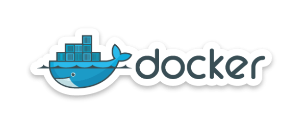
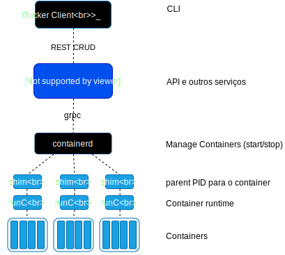

name: splash
layout: true
class: center, middle, inverse

---
count:false
# Docker - Infraestrutura imutavel

# by [@famsbh](http://twitter.com/famsbh)

---
layout: true
name: sessao
class: left, center, inverse
#.logo-linux[]

---
layout: true
name: conteudo
class: left, top
.logo-linux[]

---
template: conteudo

# Agenda


### Dia 2
 - Docker Compose
 - Docker network
 - Docker Volumes
 - Docker Security

---


# Comunicação entre containers
 - EXPOSE
 - \-p
 - docker create network

# Iniciando containers intergrados
```bash
$ docker network create curso
$ docker run -d --network curso --name redis redis -v ./redis-data:/data
$ docker run -d --network curso --name contador -p 5000:5000 contador
```

---
# Gerenciando multiplos containers com docker-compose
- Um arquivo de configuração para todo o ambiente
- Define todo o ambiente do Dockerfile para serem reproduzíveis
- Define os serviços de um container para executarem em um abiente isolado
- Gerencia o ciclo de vida de todos os containers descritos

---
# docker-compose.yaml
```yaml
version: '3'
services:
  contador:
    image: "fams/contador:latest"
    ports:
     - "5000:5000"
    networks:
      - contador

  redis:
    image: "redis:latest"
    command: ["redis-server", "--appendonly", "yes"]
    volumes:
      - ./redis-data:/data
    networks:
      - contador

networks:
  contador:
```

---
# docker-compose volumes
```yaml
version: '3'
services:
  redis:
  ...
    volumes:
      - ./redis/redis.conf:/usr/local/etc/redis/redis.conf
      - redis-data:/data
...
volumes:
  redis-data:
```

---
template: splash


# Docker Containers Internals
### Entendendo de verdade

---
template: conteudo
# Componentes

- Docker client
- Docker daemon
- containerd
- runc
- shim
- docker HUB

---

# Docker container Model

.full-image-height[]

---

# Docker container Model

.full-image-height[]

---

# Docker Client

- cmdline
- comunica com o Daemon por CRUD REST
- comunicacão tcp, socket
- tls security
- auth plugins

---

# Docker Daemon
- Serve a API
- network services
- comunicação com o mundo
- Acesso ao Docker HUB
- REST com client
- GRPC com containerd

---

# containerd
- Parte da estratégia de remover codigo do daemon
- Gerencia o ciclo de vida do container (start, stop, pause)
- Gerencia as imagens (prepara para o runc)
- OCI

---

# runc
- implementação de wrapper para  libcontainer
- especificacão OCI
- Morre após a carga
- Problema de segurança em 2019

--
### shim
 - captura stdin, stdout dos processos
 - permite os containers funcionarem detached

---
# Internals CGROUPS

- Hierarquias
 - CPU
 - Memory
 - blkio
 - devices

---
# Namespaces
.full-image[]

---

# Namespaces
 - pid
 - net
 - mnt
 - uts
 - ipc
 - user

---

# Drop Privileges/Security
- AppArmor
- Selinux
- CAP_ADMIN

---

# Docker Images
- Dockerfile
- imagens em camadas
- docker HUB
- imagens oficiais

---

template: splash

# Docker Containers Network
### interligando containers

---
template: conteudo

# Visão geral de rede no Docker

- Conteiners precisam falar com o mundo
- Conteiners proveem serviços, o mundo precisa falar com eles
- Conteiners precisam falar uns com os outros
  - Localmente
  - Entre Hosts
- Como fazer descoberta de serviços providos pelos containers
- Load Balance

???
 - Nework Brige
 - Publish port
 - Networks, drivers
 - DNS
 - Load Balance

---

# Visão Geral Rede Docker

- docker run -p
- docker container port
- Just Works (DEV/STAGE)

???
 - expoe porta do host
 - Mostra portas expostas no HOST
 - Baterias inclusas mas removiveis

---

# Padrão de rede no Docker

 - Conectar em uma rede bridge padrão (docker0)
 - Redebe IP da rede padrão e acessa o mundo por NAT do host
 - Podem acessar uns aos outros sem o -p
 - Melhor prática criar uma rede propria

---

# Comandos Rede

- Listar redes: docker network ls
- Descrever rede: docker network inspect <NOME/ID>
- Criar rede: docker netwrok create --driver
- Conectar container à rede: docker network connect
- Desconectar container à rede: docker network disconnect

---

#LAB
 - Criar uma rede
 - Subir um container nessa rede
 - Listar informação da rede
 - anexar a rede a outro container
 - retirar rede do container.
 - acessar um container pelo outro, por ip e  por nome

---

# DNS RR
 - Balanceamento por DNS
 - Implementado pelo daemon
 - --net-alias <ALIAS>

---
# LAB DNS RR
- Criar dois containers NGINX com o mesmo net-alias
- Executar um container BASH e testar a resolução de nomes

---
# Network More

- Bridge
- Host
- Overlay
- Macvlan
- None
- Plugins

---
# CNM

.full-image-height[![Container Network Model][cnm]]
[cnm]: /img/cnm.png "Container Network Model"

---
#Host Driver
.full-image-height[![Host Networkl][host-driver]]
[host-driver]: /img/host-driver.png "Host Driver"

---
# Bridge
.full-image-height[![Bridge Networkl][bridge-driver]]
[bridge-driver]: /img/bridge-driver.png "Bridge Driver"

---
# Bridge
.full-image-height[![Bridge Networkl][bridge2]]
[bridge2]: /img/bridge2.png "Bridge Driver"

---
# Acesso Externo
.full-image[![External Access][nat]]
[nat]: /img/nat.png "External Access"
